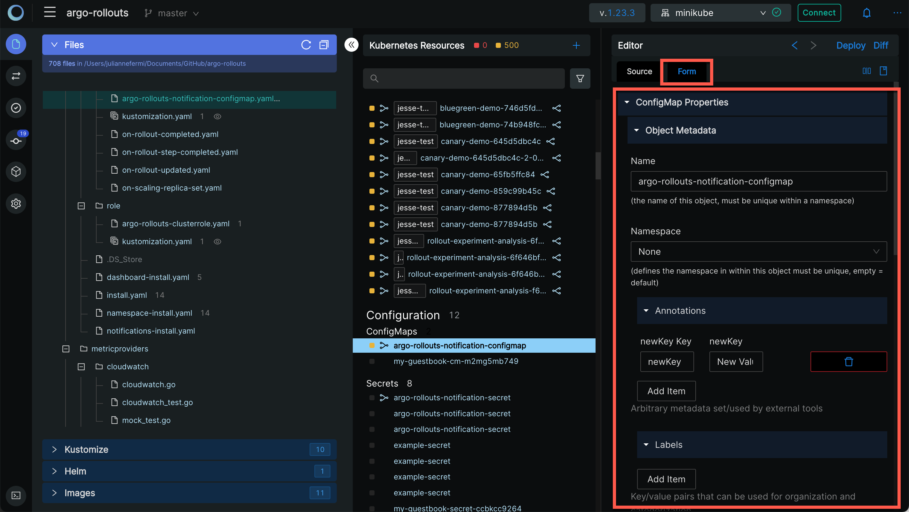
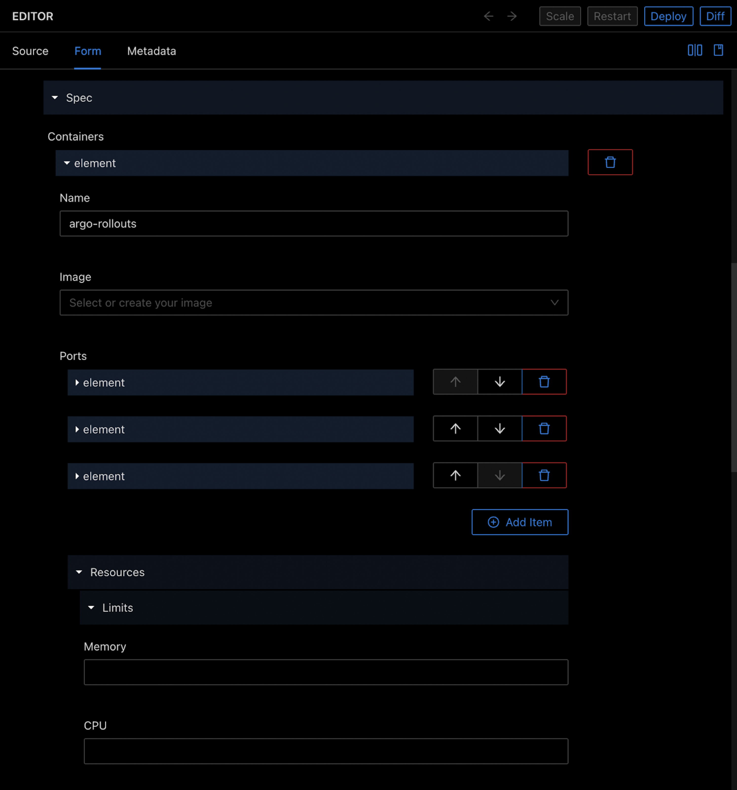
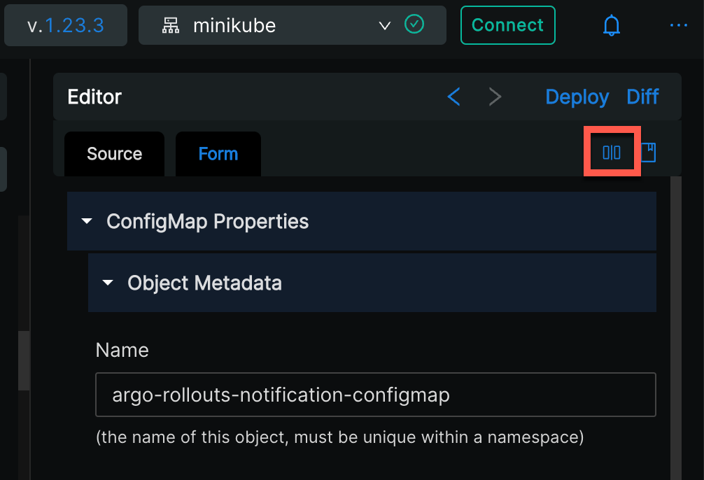
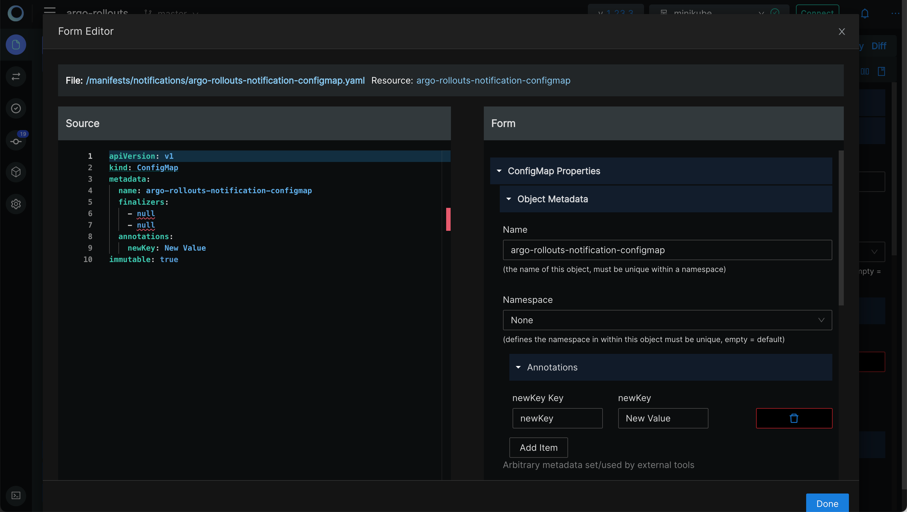
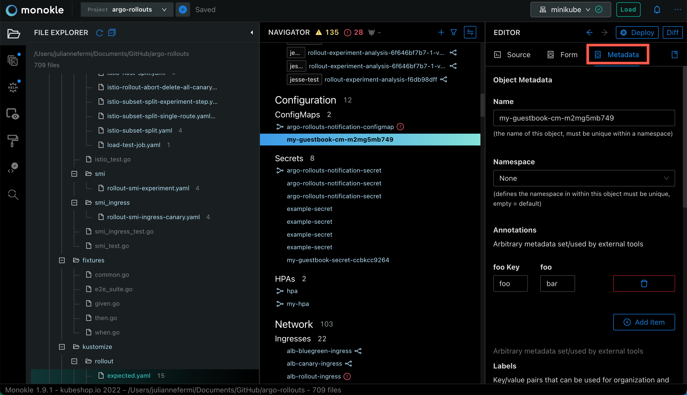

# Using the Form Editor

## **Edit Resources Properties via Form**

Monokle Desktop shows form editors for diverse Kubernetes resources which allows you to interactively change the specification of your resources using visual controls/inputs.

For example in the case of a ConfigMap Kubernetes resource, clicking on the **Form** tab at the top of the Editor, opens the form fields editor for key ConfigMap properties, allowing you to edit/discover all available properties without having to learn or lookup the corresponding YAML/resource documentation. Any changes made and saved (with the Save button on the top right)
are written back to the underlying YAML. 

### **Modified Values Highlighted in Code Editor**

To have insight into the changes made to your configuration, the exact properties edited with Monokle’s Form Editor are highlighted when you make the transition from the Form Editor tab to the Source tab. This highlighting feature identifies all changes providing full visibility of edited resources as you work toward attaining your desired state.

### **Side-by-Side Editors**

The configuration file you are editing can be visible even when you are using templates.

Click on the side-by-side icon at the top right of the editor to open a side-by-side view showing the source code on the left and the form editor on the right, providing instant visibility of the changed files while updating the state. 

## **Using the Object Metadata Editor**

To launch the Metadata Editor, click on the **Metadata** tab.

For editing object metadata, you need to provide a specific name, namespace, annotations, labels, cluster name, generate name, and finalizers to uniquely identify the object.  

**Check out [this tutorial](tutorials/how-to-create-and-edit-configmap.md) for more details 
on how to use the Form Editor and Metadata.**
