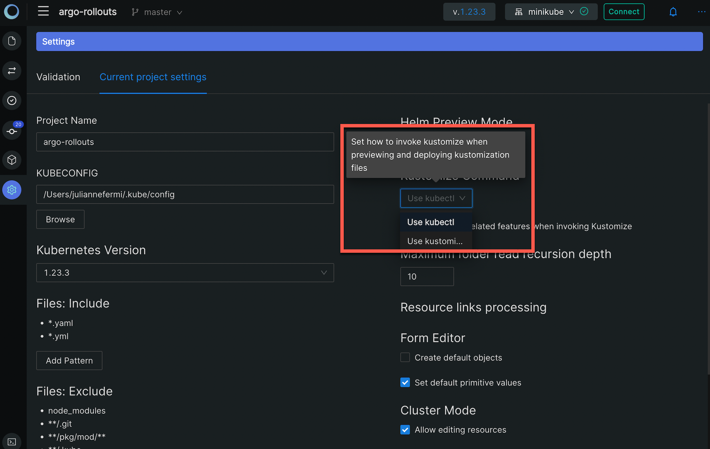
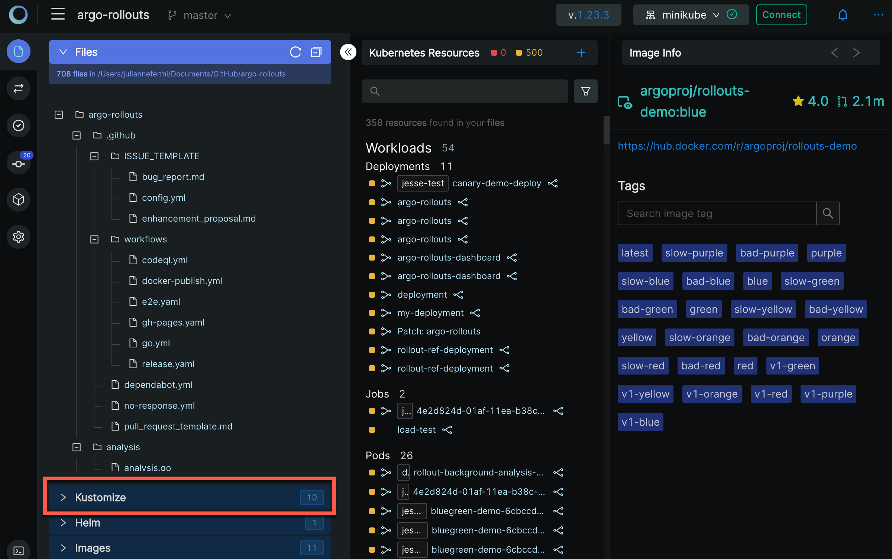
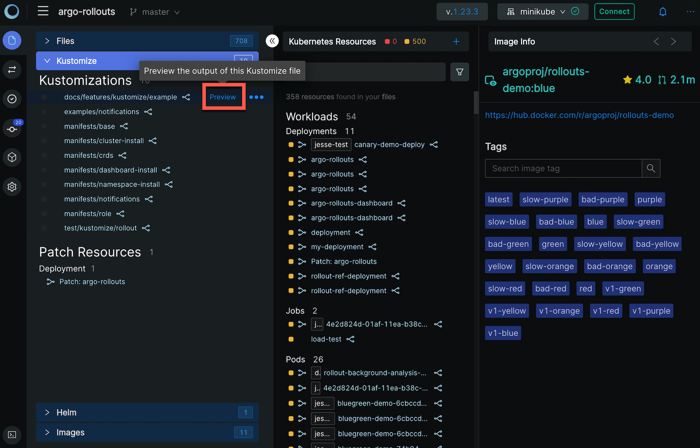
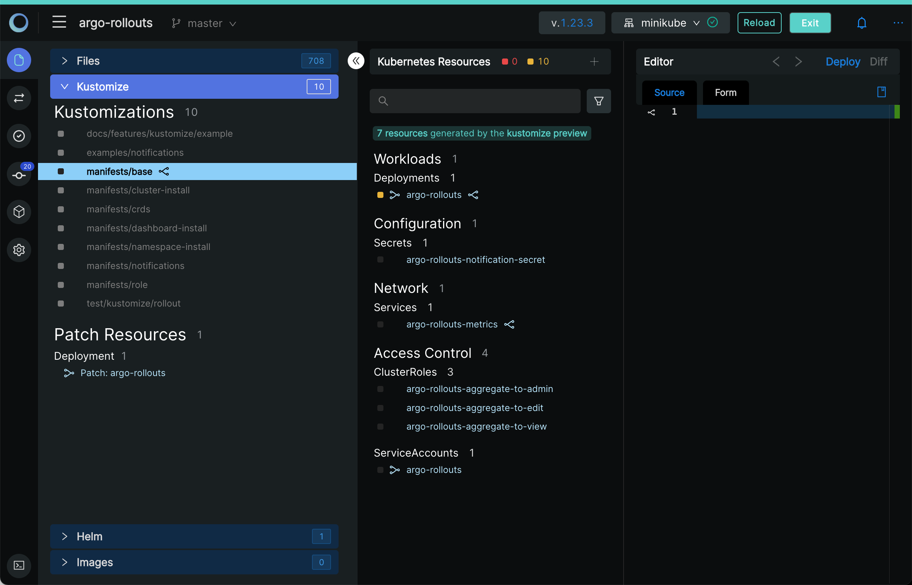
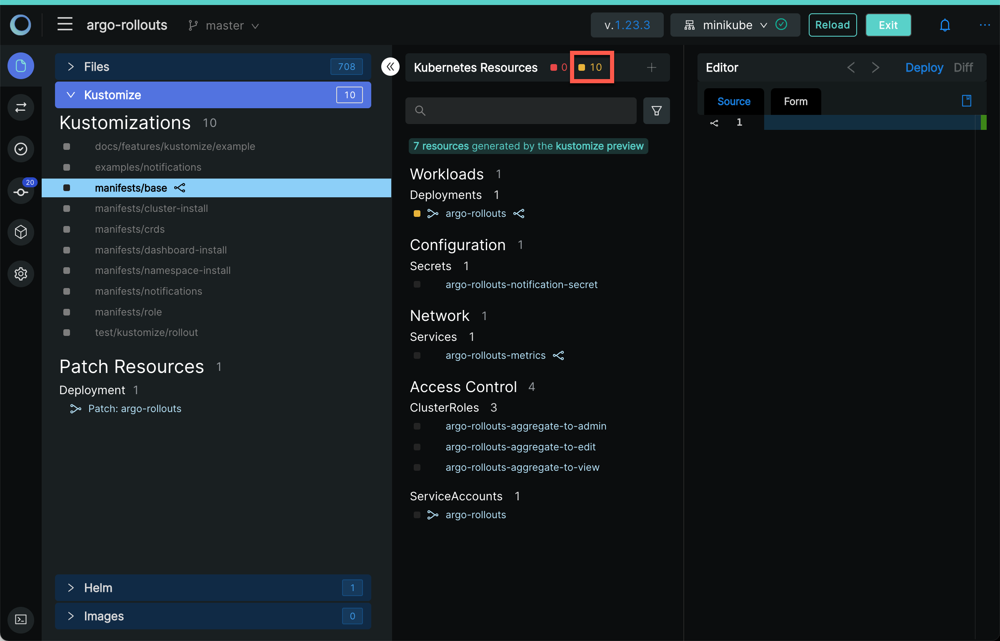
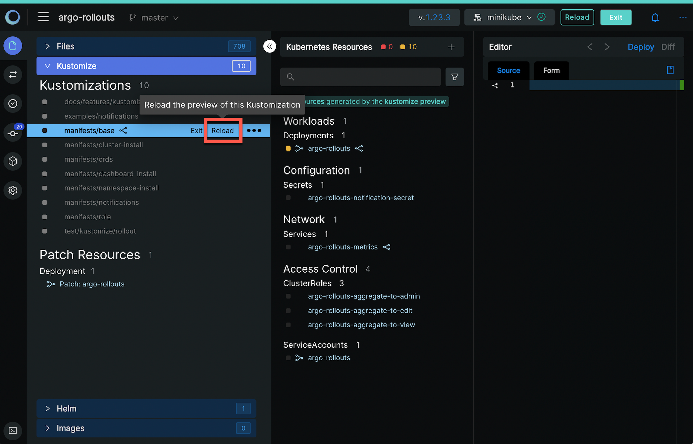

# Working with Kustomize 

Monokle Desktop has built-in support for [Kustomize](https://kustomize.io/) - a popular tool for managing Kubernetes configurations:

- Monokle Desktop can visualize dependencies and relationships between kustomize files to help you understand the scope of
  a specific kustomization.
- Monokle Desktop can preview resources generated by Kustomize, helping you debug your configurations before you deploy them to 
  your cluster (requires kubectl to be installed and configured in your PATH).

All examples below are from the [Argo Rollouts Manifest Folder](https://github.com/argoproj/argo-rollouts/tree/master/manifests) - clone and try these yourself!

## **Configuring Kustomize Integration**

In Settings, set the defaults for working with Kustomize in Monokle Desktop:

Use the drop-down selector to select how to invoke Kustomize when previewing or applying kustomization files:

Tick the check box to enable Helm-related functionality when invoking Kustomize.

## **Kustomize Navigation**

To work with a project's kustomization.yaml files, click **Kustomize**:

In the screenshot:

- The Kustomize section shows all kustomization.yaml files - named after the folder they are in relative to the selected root folder.
- The "base" kustomization.yaml has been selected
    - The corresponding kustomization.yaml file has been highlighted to the left.
    - All "downstream" kustomizations and included resources are highlighted in the Navigator, helping you understand the "scope" of the selected kustomization.
    - The content of the kustomzation resource is shown in the Source editor to the right, with corresponding resource links marked in the code.

Just as with K8s resources, hovering over the link-icon to the right of the kustomization name shows its outgoing links:

Here we can see the 10 resources included by the selected kustomization.

Hovering the link-icon to the left of the kustomization name shows its incoming links:

  

Here we see one "upstream" kustomization that include the selected kustomization in its configuration.

## **Kustomize Preview**

While the above helps you understand the relationships and dependencies between kustomizations and their included resources, the
Preview functionality helps you understand what resources would be installed in your cluster when running kustomize.

Hovering over a kustomization reveals a **Preview** action to the right:

Selecting this action will run kustomize on the selected file with the **-k** option and replace the contents of the Navigator with the 
generated resources.  

For example previewing the "base" kustomization above will result in the following:

Monokle Desktop is now in **Preview Mode** (as indicated by the header at the top):

- The File Explorer has been disabled.
- The Navigator now contains all resources generated by running Kustomize with the "base" kustomization:
    - Resource navigation works as with files; selecting a resource shows its content in the source editor in read-only mode.
    - Resource links are shown as before with corresponding popups/links/etc.
- Selecting **Preview** for a different kustomization will switch the output of kustomize to that resource instead.
- Selecting **Exit** in the top right or next to the kustomization restores the previous resource navigator.

In the screenshot we can see that the selected kustomization resulted in 14 resources that contain references to the image
specified in the kustomization configuration:

## **Editing of Kustomizations During Preview**

When previewing a kustomization, it is possible to edit the previewed kustomization.yaml file and **reload** the preview, allowing 
you to quickly assess the impact of any changes on the generated files, instead of having to exit and recreate the preview to make a change.
 

