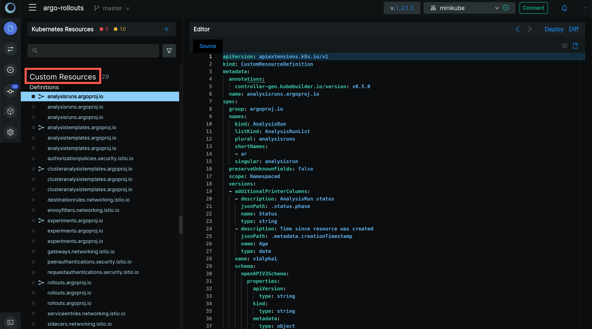
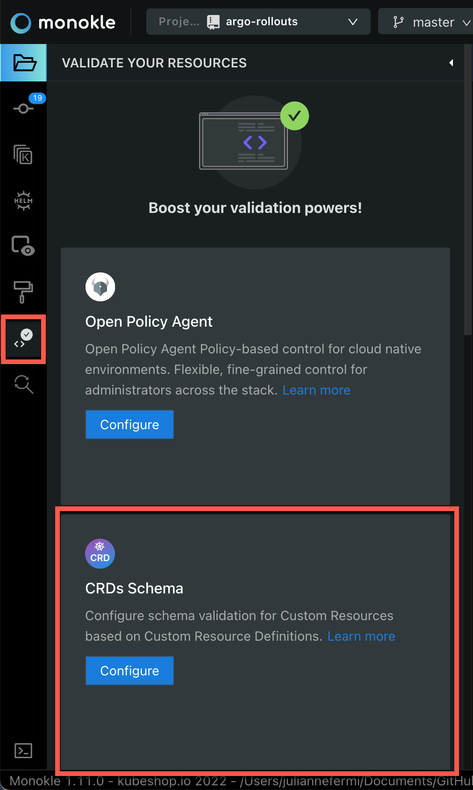

# Custom Resource Definitions

The CustomResourceDefinition API resource allows you to define custom resources.   
Defining a CRD object creates a new custom resource with a name and schema that you specify.  
The Kubernetes API serves and handles the storage of your custom resource.  
[Read more about CRDs here](https://kubernetes.io/docs/concepts/extend-kubernetes/api-extension/custom-resources/#customresourcedefinitions).

## **How are CRDs used by Monokle Desktop?**

Monokle Desktop uses CRDs to recognize the Custom Resources that you're creating. All CRDs that registered in Monokle and installed on the cluster are visible on Cluster Definition section on Cluster Dashboard 

By default, any Custom Resource that does not have a CRD registered in Monokle Desktop, will show up in the Navigator under the "Unknown Resources" section.  

After registering a CRD, Monokle Desktop will do the following:  
  - Validate Custom Resources based on the schema provided by the CRD. 
  - Generate Form Editors based on the CRD schema.  
  - Enable Cluster interactions on the Custom Resources.  

## **How can you register a CRD?**

There are 2 ways:

1. Load the objects from a Cluster.  
Monokle Desktop will scan the resources and, if it finds a CRD, it will register it so it can later recognize the Custom Resources.

2. Use the CRDs Schema panel from the Validation tab.  
This panel lists all the CRDs that are already registered in Monokle Desktop and you can register new CRDs by providing a URL pointing to YAML content.

