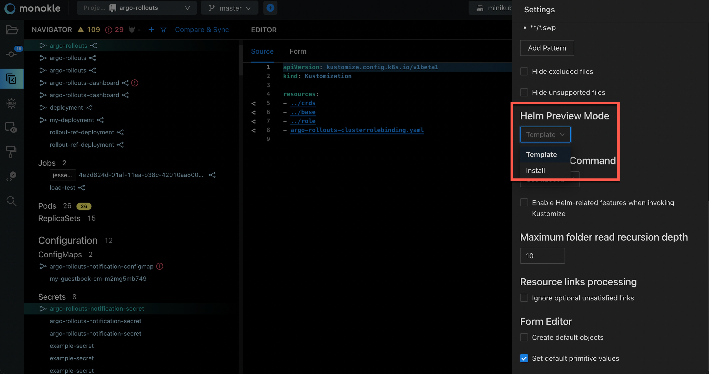
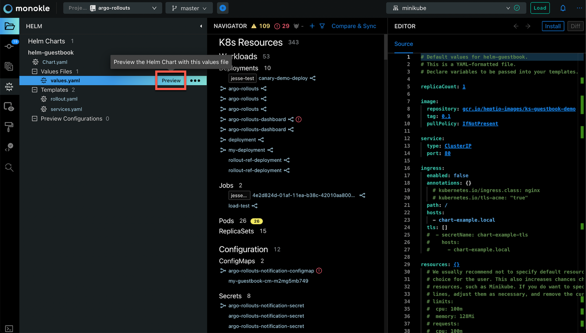
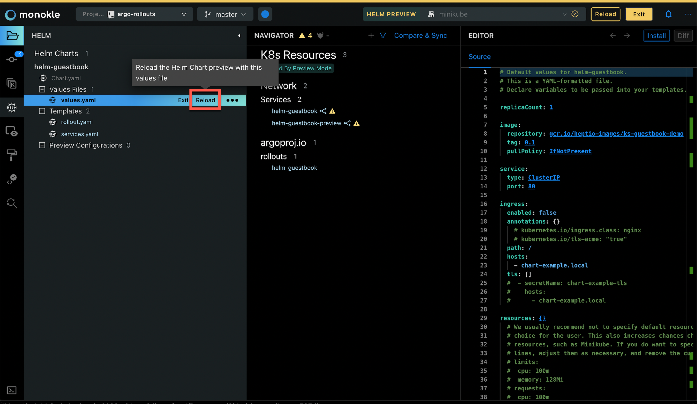

# Working with Helm

Monokle has built-in support for [Helm](https://helm.sh/) - a popular tool for managing Kubernetes configurations:

- Monokle can identify and show Helm charts and their values files.  
- Monokle can preview resources generated by Helm, helping you debug your charts before you deploy them to your cluster. This requires Helm to be installed and configured in your PATH.

All examples below are from the [Emissary Ingress Charts Folder](https://github.com/emissary-ingress/emissary/tree/master/charts/emissary-ingress) - clone and try these yourself!

## **Configuring Helm Integration**

In Settings, set which Helm command to use when generating Helm previews in Monokle:

## **Helm Preview Configurations**

Each Helm chart has a subsection named **Preview Configurations**. This allows you to configure how to run the Helm Preview and then save the configuration in order to quickly use it at any time.

Hovering over the Preview Configurations section will show a Plus button to the right:

Clicking on the button will open a Drawer to the right:

This form allows you to:
- Name your configuration.
- Choose and order which values files to be used for the preview.
- Choose between using the **helm template** or **helm install** commands.
- And, optionally, provide options for the command. See more about the options in Helm’s documentation: https://helm.sh/docs/helm/helm_install/.

Finally, you can save your configuration for later use or save it and start previewing the resources right away.

Saved Preview Configurations will show up in the subsection of the Helm chart it was created for:

By hovering over the configuration you will see the Preview, Edit and Delete actions.

If you instead click and select the configuration, the source code editor from the right will be replaced with the Helm Command Pane, which will display the generated command that will be run by Monokle to create the preview:

## **Helm Navigation**

When selecting a folder containing Helm charts (identified by Chart.yaml files), these will automatically be displayed in 
a "Helm Charts" section on top of the Navigator:

In the screenshot:

* The Helm Charts section shows the "emissary-ingress" Helm chart and the contained values files.
* The single values.yaml file has been selected.
* The corresponding values.yaml file has been highlighted to the left.
* The content of the file is shown in the Source editor on the right of the screen.

The Navigator at this point shows any K8s resources that Monokle finds in the selected folder.

## **Helm Preview**

The Helm Preview functionality helps you understand what resources would be installed in your cluster when running Helm with 
a specific values file.

Hovering over a values file reveals a **Preview** action to the right:

Selecting this action will run Helm on the selected file with either the `install` or `template` option (as configured in the global settings)
and replace the contents of the Navigator with the generated resources.

For example, previewing the values file above will result in the following:

Monokle is now in **Preview Mode** (as indicated by the header at the top):

- The File Explorer has been disabled.
- The Navigator now contains all resources generated by running Helm with the selected values file.
    - Resource navigation works as with files; selecting a resource shows its content in the source editor in read-only mode.
    - Resource links are shown as before with corresponding popups/links/etc.
- Selecting **Preview** for a different values file will switch the preview to the output of Helm for that file.
- Selecting **Exit** in the top right or next to the values file restores the previous resource navigator.

## **Editing of Values Files**

If you're editing Helm Values files, Monokle will highlight all properties that have been referenced by any templates.
The list of paths to template files is shown when hovering over the highlighted value.

When previewing a Helm values file, it is possible to edit the previewed file and recreate the preview, allowing
you to quickly assess the impact of any changes on the generated files, instead of having to exit and recreate the preview to make a change.
 

## **Working with Helm Templates**

Each Helm Chart from the Helm pane has a subsection which displays all templates of that chart.
Clicking on a template will select it and open it in the Editor.

When you hover over a value referenced from a Values file, the popup that appears will display the following information:
- The path to the values file where the reference is from.
- The referenced value, so you don't have to switch to the Values file.
- A link to quickly navigate to the location of that value.

If Monokle cannot find any values file with the referenced path from a Helm template, it will highlight it in yellow:

